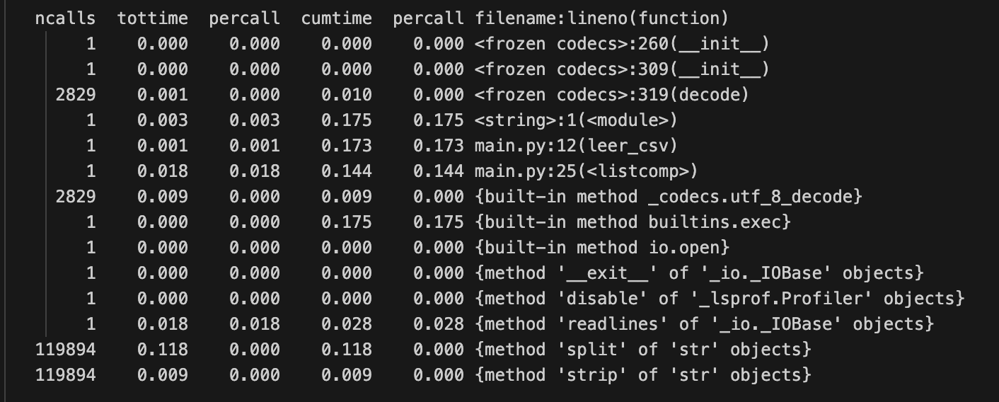

## GreenTextBooks

---
## ¿En qué consiste?

GreenTextBooks es un proyecto dedicado al análisis de datos abiertos de educación proporcionados por la Junta de Andalucía
---
## Problema a resolver

¿Qué editoriales de libros de texto son las más elegidas por los centros públicos y concertados? <!-- .element: class="fragment" -->
---
## Organización del trabajo

Repositorio en Github <!-- .element: class="fragment" -->

Github Project (agile) <!-- .element: class="fragment" -->

Presentación con RevealJS usando Github Pages <!-- .element: class="fragment" -->
---
## Implementación inicial

Lenguaje elegido: Python <!-- .element: class="fragment" -->

Motivo: Fácil de usar y ejecutar <!-- .element: class="fragment" -->

Sin dependecias <!-- .element: class="fragment" -->
---
## Pruebas realizadas

Profilling manual con Time:  <!-- .element: class="fragment" -->

0,1459 segundos (M3 Pro)  <!-- .element: class="fragment" -->

Profilling automático con CProfile:  <!-- .element: class="fragment" -->

245456 function calls in 0.175 seconds (M3 Pro)  <!-- .element: class="fragment" -->

## Medición energética

<small>Platform system: macOS-14-5-arm64-arm-64bit </small>

<small>Python version: 3.9.6</small>

<small>CodeCarbon version: 2.2.3</small>

<small>CPU count: 8</small>

<small>CPU model: apple M2</small>

<small>Energy consumed for RAM : 0.0000000 kWh. </small>

<small>Energy consumed for all CPUs : 0,00000002 kWh. </small>

<small>Total CPU Power : 42.5 W</small>

Función leer_csv:

0.000002 kWh of electricity used since the beginning

## powermetrics

3,787 W (30 ejecuciones del programa completo)
---
## Prueba con Kotlin

Tiempos peores  <!-- .element: class="fragment" -->

0,196 segundos (M3 Pro)  <!-- .element: class="fragment" -->
---
## Optimizaciones posibles

La función que más tiempo necesita es leer_csv  <!-- .element: class="fragment" -->

Uso de dependencias como csv, pandas o numpy empeora los tiempos  <!-- .element: class="fragment" -->

De 0,149 a 0,2  <!-- .element: class="fragment" -->
---
## Conclusiones

El problema no es complejo, difícil de optimizar <!-- .element: class="fragment" -->

Muchas veces es mejor evitar dependencias <!-- .element: class="fragment" -->
---
## ¿Dudas?